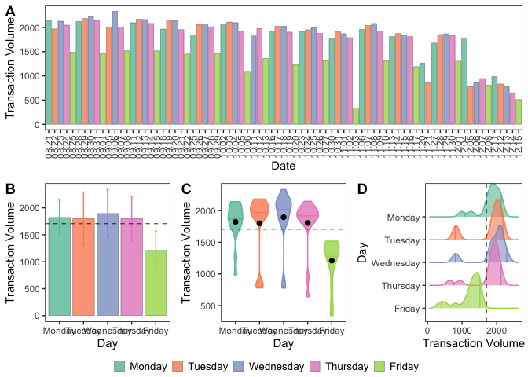
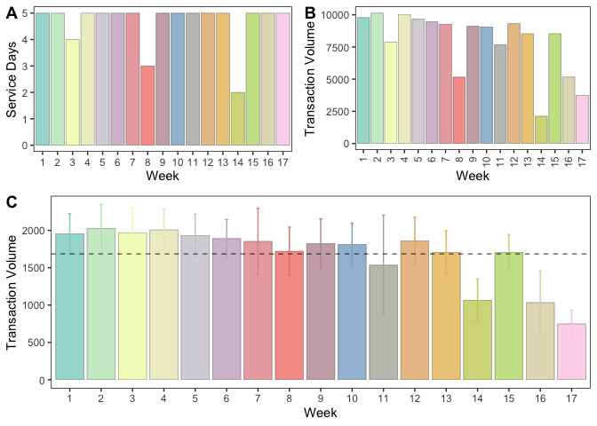

Planning Script
================
Last Update: July 17, 2024

# Package Loading

``` r
library(tidyverse)
```

    ## ── Attaching packages ─────────────────────────────────────── tidyverse 1.3.2 ──
    ## ✔ ggplot2 3.4.1      ✔ purrr   0.3.4 
    ## ✔ tibble  3.1.8      ✔ dplyr   1.0.10
    ## ✔ tidyr   1.2.1      ✔ stringr 1.4.1 
    ## ✔ readr   2.1.2      ✔ forcats 0.5.2 
    ## ── Conflicts ────────────────────────────────────────── tidyverse_conflicts() ──
    ## ✖ dplyr::filter() masks stats::filter()
    ## ✖ dplyr::lag()    masks stats::lag()

``` r
library(forcats)
library(lazyeval)
```

    ## 
    ## Attaching package: 'lazyeval'
    ## 
    ## The following objects are masked from 'package:purrr':
    ## 
    ##     is_atomic, is_formula

``` r
library(ggpubr)
library(ggridges)
library(RColorBrewer)
```

# Data Loading

``` r
transaction_volume <- read.csv("/Users/kenjinchang/github/multimodal-dining-study/data/parent-data/transaction-volume-082023121623.csv")
```

# Data Cleaning

``` r
transaction_volume_by_minute <- transaction_volume %>%
  select(Hour,X15.Minutes,Business.Date,Transactions) %>%
  rename(hour=Hour,interval=X15.Minutes,date=Business.Date,count=Transactions) %>%
  unite(minute_hour,c(hour,interval),sep=":",remove=FALSE) %>%
  unite(date_time,c(date,minute_hour),sep=", ", remove=FALSE)
```

adding day

``` r
transaction_volume_by_minute <- transaction_volume_by_minute %>%
  mutate(day=case_when(date=="08/21/2023"~"Monday",date=="08/22/2023"~"Tuesday",date=="08/23/2023"~"Wednesday",date=="08/24/2023"~"Thursday",date=="08/25/2023"~"Friday",date=="08/28/2023"~"Monday",date=="08/29/2023"~"Tuesday",date=="08/30/2023"~"Wednesday",date=="08/31/2023"~"Thursday",date=="09/01/2023"~"Friday",date=="09/05/2023"~"Tuesday",date=="09/06/2023"~"Wednesday",date=="09/07/2023"~"Thursday",date=="09/08/2023"~"Friday",date=="09/11/2023"~"Monday",date=="09/12/2023"~"Tuesday",date=="09/13/2023"~"Wednesday",date=="09/14/2023"~"Thursday",date=="09/15/2023"~"Friday",date=="09/18/2023"~"Monday",date=="09/19/2023"~"Tuesday",date=="09/20/2023"~"Wednesday",date=="09/21/2023"~"Thursday",date=="09/22/2023"~"Friday",date=="09/25/2023"~"Monday",date=="09/26/2023"~"Tuesday",date=="09/27/2023"~"Wednesday",date=="09/28/2023"~"Thursday",date=="09/29/2023"~"Friday",date=="10/02/2023"~"Monday",date=="10/03/2023"~"Tuesday",date=="10/04/2023"~"Wednesday",date=="10/05/2023"~"Thursday",date=="10/06/2023"~"Friday",date=="10/11/2023"~"Wednesday",date=="10/12/2023"~"Thursday",date=="10/13/2023"~"Friday",date=="10/16/2023"~"Monday",date=="10/17/2023"~"Tuesday",date=="10/18/2023"~"Wednesday",date=="10/19/2023"~"Thursday",date=="10/20/2023"~"Friday",date=="10/23/2023"~"Monday",date=="10/24/2023"~"Tuesday",date=="10/25/2023"~"Wednesday",date=="10/26/2023"~"Thursday",date=="10/27/2023"~"Friday",date=="10/30/2023"~"Monday",date=="10/31/2023"~"Tuesday",date=="11/01/2023"~"Wednesday",date=="11/02/2023"~"Thursday",date=="11/03/2023"~"Friday",date=="11/06/2023"~"Monday",date=="11/07/2023"~"Tuesday",date=="11/08/2023"~"Wednesday",date=="11/09/2023"~"Thursday",date=="11/10/2023"~"Friday",date=="11/13/2023"~"Monday",date=="11/14/2023"~"Tuesday",date=="11/15/2023"~"Wednesday",date=="11/16/2023"~"Thursday",date=="11/17/2023"~"Friday",date=="11/18/2023"~"Saturday",date=="11/20/2023"~"Monday",date=="11/21/2023"~"Tuesday",date=="11/27/2023"~"Monday",date=="11/28/2023"~"Tuesday",date=="11/29/2023"~"Wednesday",date=="11/30/2023"~"Thursday",date=="12/01/2023"~"Friday",date=="12/04/2023"~"Monday",date=="12/05/2023"~"Tuesday",date=="12/06/2023"~"Wednesday",date=="12/07/2023"~"Thursday",date=="12/08/2023"~"Friday",date=="12/11/2023"~"Monday",date=="12/12/2023"~"Tuesday",date=="12/13/2023"~"Wednesday",date=="12/14/2023"~"Thursday",date=="12/15/2023"~"Friday"))
```

adding week

``` r
transaction_volume_by_minute <- transaction_volume_by_minute %>%
  mutate(week=case_when(date=="08/21/2023"~"1",date=="08/22/2023"~"1",date=="08/23/2023"~"1",date=="08/24/2023"~"1",date=="08/25/2023"~"1",date=="08/28/2023"~"2",date=="08/29/2023"~"2",date=="08/30/2023"~"2",date=="08/31/2023"~"2",date=="09/01/2023"~"2",date=="09/05/2023"~"3",date=="09/06/2023"~"3",date=="09/07/2023"~"3",date=="09/08/2023"~"3",date=="09/11/2023"~"4",date=="09/12/2023"~"4",date=="09/13/2023"~"4",date=="09/14/2023"~"4",date=="09/15/2023"~"4",date=="09/18/2023"~"5",date=="09/19/2023"~"5",date=="09/20/2023"~"5",date=="09/21/2023"~"5",date=="09/22/2023"~"5",date=="09/25/2023"~"6",date=="09/26/2023"~"6",date=="09/27/2023"~"6",date=="09/28/2023"~"6",date=="09/29/2023"~"6",date=="10/02/2023"~"7",date=="10/03/2023"~"7",date=="10/04/2023"~"7",date=="10/05/2023"~"7",date=="10/06/2023"~"7",date=="10/11/2023"~"8",date=="10/12/2023"~"8",date=="10/13/2023"~"8",date=="10/16/2023"~"9",date=="10/17/2023"~"9",date=="10/18/2023"~"9",date=="10/19/2023"~"9",date=="10/20/2023"~"9",date=="10/23/2023"~"10",date=="10/24/2023"~"10",date=="10/25/2023"~"10",date=="10/26/2023"~"10",date=="10/27/2023"~"10",date=="10/30/2023"~"11",date=="10/31/2023"~"11",date=="11/01/2023"~"11",date=="11/02/2023"~"11",date=="11/03/2023"~"11",date=="11/06/2023"~"12",date=="11/07/2023"~"12",date=="11/08/2023"~"12",date=="11/09/2023"~"12",date=="11/10/2023"~"12",date=="11/13/2023"~"13",date=="11/14/2023"~"13",date=="11/15/2023"~"13",date=="11/16/2023"~"13",date=="11/17/2023"~"13",date=="11/18/2023"~"13",date=="11/20/2023"~"14",date=="11/21/2023"~"14",date=="11/27/2023"~"15",date=="11/28/2023"~"15",date=="11/29/2023"~"15",date=="11/30/2023"~"15",date=="12/01/2023"~"15",date=="12/04/2023"~"16",date=="12/05/2023"~"16",date=="12/06/2023"~"16",date=="12/07/2023"~"16",date=="12/08/2023"~"16",date=="12/11/2023"~"17",date=="12/12/2023"~"17",date=="12/13/2023"~"17",date=="12/14/2023"~"17",date=="12/15/2023"~"17"))
```

abbreviate date format

``` r
transaction_volume_by_minute <- transaction_volume_by_minute %>%
  mutate(date_abbrev=case_when(date=="08/21/2023"~"08.21",date=="08/22/2023"~"08.22",date=="08/23/2023"~"08.23",date=="08/24/2023"~"08.24",date=="08/25/2023"~"08.25",date=="08/28/2023"~"08.28",date=="08/29/2023"~"08.29",date=="08/30/2023"~"08.30",date=="08/31/2023"~"08.31",date=="09/01/2023"~"09.01",date=="09/05/2023"~"09.05",date=="09/06/2023"~"09.06",date=="09/07/2023"~"09.07",date=="09/08/2023"~"09.08",date=="09/11/2023"~"09.11",date=="09/12/2023"~"09.12",date=="09/13/2023"~"09.13",date=="09/14/2023"~"09.14",date=="09/15/2023"~"09.15",date=="09/18/2023"~"09.18",date=="09/19/2023"~"09.19",date=="09/20/2023"~"09.20",date=="09/21/2023"~"09.21",date=="09/22/2023"~"09.22",date=="09/25/2023"~"09.25",date=="09/26/2023"~"09.26",date=="09/27/2023"~"09.27",date=="09/28/2023"~"09.28",date=="09/29/2023"~"09.29",date=="10/02/2023"~"10.02",date=="10/03/2023"~"10.03",date=="10/04/2023"~"10.04",date=="10/05/2023"~"10.05",date=="10/06/2023"~"10.06",date=="10/11/2023"~"10.11",date=="10/12/2023"~"10.12",date=="10/13/2023"~"10.13",date=="10/16/2023"~"10.16",date=="10/17/2023"~"10.17",date=="10/18/2023"~"10.18",date=="10/19/2023"~"10.19",date=="10/20/2023"~"10.20",date=="10/23/2023"~"10.23",date=="10/24/2023"~"10.24",date=="10/25/2023"~"10.25",date=="10/26/2023"~"10.26",date=="10/27/2023"~"10.27",date=="10/30/2023"~"10.30",date=="10/31/2023"~"10.31",date=="11/01/2023"~"11.01",date=="11/02/2023"~"11.02",date=="11/03/2023"~"11.03",date=="11/06/2023"~"11.06",date=="11/07/2023"~"11.07",date=="11/08/2023"~"11.08",date=="11/09/2023"~"11.09",date=="11/10/2023"~"11.10",date=="11/13/2023"~"11.13",date=="11/14/2023"~"11.14",date=="11/15/2023"~"11.15",date=="11/16/2023"~"11.16",date=="11/17/2023"~"11.17",date=="11/18/2023"~"11.18",date=="11/20/2023"~"11.20",date=="11/21/2023"~"11.21",date=="11/27/2023"~"11.27",date=="11/28/2023"~"11.28",date=="11/29/2023"~"11.29",date=="11/30/2023"~"11.30",date=="12/01/2023"~"12.01",date=="12/04/2023"~"12.04",date=="12/05/2023"~"12.05",date=="12/06/2023"~"12.06",date=="12/07/2023"~"12.07",date=="12/08/2023"~"12.08",date=="12/11/2023"~"12.11",date=="12/12/2023"~"12.12",date=="12/13/2023"~"12.13",date=="12/14/2023"~"12.14",date=="12/15/2023"~"12.15"))
```

remove Saturday

``` r
transaction_volume_by_minute <- transaction_volume_by_minute %>%
  filter_at(vars(day),all_vars(!. %in% "Saturday"))
```

create version that collapses across day (disregards hour and 15-minute
intervals)

``` r
transaction_volume_by_day <- transaction_volume_by_minute %>%
  group_by(date) %>%
  summarise(sum(count)) %>%
  rename(count="sum(count)") %>%
  mutate(day=case_when(date=="08/21/2023"~"Monday",date=="08/22/2023"~"Tuesday",date=="08/23/2023"~"Wednesday",date=="08/24/2023"~"Thursday",date=="08/25/2023"~"Friday",date=="08/28/2023"~"Monday",date=="08/29/2023"~"Tuesday",date=="08/30/2023"~"Wednesday",date=="08/31/2023"~"Thursday",date=="09/01/2023"~"Friday",date=="09/05/2023"~"Tuesday",date=="09/06/2023"~"Wednesday",date=="09/07/2023"~"Thursday",date=="09/08/2023"~"Friday",date=="09/11/2023"~"Monday",date=="09/12/2023"~"Tuesday",date=="09/13/2023"~"Wednesday",date=="09/14/2023"~"Thursday",date=="09/15/2023"~"Friday",date=="09/18/2023"~"Monday",date=="09/19/2023"~"Tuesday",date=="09/20/2023"~"Wednesday",date=="09/21/2023"~"Thursday",date=="09/22/2023"~"Friday",date=="09/25/2023"~"Monday",date=="09/26/2023"~"Tuesday",date=="09/27/2023"~"Wednesday",date=="09/28/2023"~"Thursday",date=="09/29/2023"~"Friday",date=="10/02/2023"~"Monday",date=="10/03/2023"~"Tuesday",date=="10/04/2023"~"Wednesday",date=="10/05/2023"~"Thursday",date=="10/06/2023"~"Friday",date=="10/11/2023"~"Wednesday",date=="10/12/2023"~"Thursday",date=="10/13/2023"~"Friday",date=="10/16/2023"~"Monday",date=="10/17/2023"~"Tuesday",date=="10/18/2023"~"Wednesday",date=="10/19/2023"~"Thursday",date=="10/20/2023"~"Friday",date=="10/23/2023"~"Monday",date=="10/24/2023"~"Tuesday",date=="10/25/2023"~"Wednesday",date=="10/26/2023"~"Thursday",date=="10/27/2023"~"Friday",date=="10/30/2023"~"Monday",date=="10/31/2023"~"Tuesday",date=="11/01/2023"~"Wednesday",date=="11/02/2023"~"Thursday",date=="11/03/2023"~"Friday",date=="11/06/2023"~"Monday",date=="11/07/2023"~"Tuesday",date=="11/08/2023"~"Wednesday",date=="11/09/2023"~"Thursday",date=="11/10/2023"~"Friday",date=="11/13/2023"~"Monday",date=="11/14/2023"~"Tuesday",date=="11/15/2023"~"Wednesday",date=="11/16/2023"~"Thursday",date=="11/17/2023"~"Friday",date=="11/18/2023"~"Saturday",date=="11/20/2023"~"Monday",date=="11/21/2023"~"Tuesday",date=="11/27/2023"~"Monday",date=="11/28/2023"~"Tuesday",date=="11/29/2023"~"Wednesday",date=="11/30/2023"~"Thursday",date=="12/01/2023"~"Friday",date=="12/04/2023"~"Monday",date=="12/05/2023"~"Tuesday",date=="12/06/2023"~"Wednesday",date=="12/07/2023"~"Thursday",date=="12/08/2023"~"Friday",date=="12/11/2023"~"Monday",date=="12/12/2023"~"Tuesday",date=="12/13/2023"~"Wednesday",date=="12/14/2023"~"Thursday",date=="12/15/2023"~"Friday")) %>%
  mutate(week=case_when(date=="08/21/2023"~"1",date=="08/22/2023"~"1",date=="08/23/2023"~"1",date=="08/24/2023"~"1",date=="08/25/2023"~"1",date=="08/28/2023"~"2",date=="08/29/2023"~"2",date=="08/30/2023"~"2",date=="08/31/2023"~"2",date=="09/01/2023"~"2",date=="09/05/2023"~"3",date=="09/06/2023"~"3",date=="09/07/2023"~"3",date=="09/08/2023"~"3",date=="09/11/2023"~"4",date=="09/12/2023"~"4",date=="09/13/2023"~"4",date=="09/14/2023"~"4",date=="09/15/2023"~"4",date=="09/18/2023"~"5",date=="09/19/2023"~"5",date=="09/20/2023"~"5",date=="09/21/2023"~"5",date=="09/22/2023"~"5",date=="09/25/2023"~"6",date=="09/26/2023"~"6",date=="09/27/2023"~"6",date=="09/28/2023"~"6",date=="09/29/2023"~"6",date=="10/02/2023"~"7",date=="10/03/2023"~"7",date=="10/04/2023"~"7",date=="10/05/2023"~"7",date=="10/06/2023"~"7",date=="10/11/2023"~"8",date=="10/12/2023"~"8",date=="10/13/2023"~"8",date=="10/16/2023"~"9",date=="10/17/2023"~"9",date=="10/18/2023"~"9",date=="10/19/2023"~"9",date=="10/20/2023"~"9",date=="10/23/2023"~"10",date=="10/24/2023"~"10",date=="10/25/2023"~"10",date=="10/26/2023"~"10",date=="10/27/2023"~"10",date=="10/30/2023"~"11",date=="10/31/2023"~"11",date=="11/01/2023"~"11",date=="11/02/2023"~"11",date=="11/03/2023"~"11",date=="11/06/2023"~"12",date=="11/07/2023"~"12",date=="11/08/2023"~"12",date=="11/09/2023"~"12",date=="11/10/2023"~"12",date=="11/13/2023"~"13",date=="11/14/2023"~"13",date=="11/15/2023"~"13",date=="11/16/2023"~"13",date=="11/17/2023"~"13",date=="11/18/2023"~"13",date=="11/20/2023"~"14",date=="11/21/2023"~"14",date=="11/27/2023"~"15",date=="11/28/2023"~"15",date=="11/29/2023"~"15",date=="11/30/2023"~"15",date=="12/01/2023"~"15",date=="12/04/2023"~"16",date=="12/05/2023"~"16",date=="12/06/2023"~"16",date=="12/07/2023"~"16",date=="12/08/2023"~"16",date=="12/11/2023"~"17",date=="12/12/2023"~"17",date=="12/13/2023"~"17",date=="12/14/2023"~"17",date=="12/15/2023"~"17")) %>%
  mutate(date_abbrev=case_when(date=="08/21/2023"~"08.21",date=="08/22/2023"~"08.22",date=="08/23/2023"~"08.23",date=="08/24/2023"~"08.24",date=="08/25/2023"~"08.25",date=="08/28/2023"~"08.28",date=="08/29/2023"~"08.29",date=="08/30/2023"~"08.30",date=="08/31/2023"~"08.31",date=="09/01/2023"~"09.01",date=="09/05/2023"~"09.05",date=="09/06/2023"~"09.06",date=="09/07/2023"~"09.07",date=="09/08/2023"~"09.08",date=="09/11/2023"~"09.11",date=="09/12/2023"~"09.12",date=="09/13/2023"~"09.13",date=="09/14/2023"~"09.14",date=="09/15/2023"~"09.15",date=="09/18/2023"~"09.18",date=="09/19/2023"~"09.19",date=="09/20/2023"~"09.20",date=="09/21/2023"~"09.21",date=="09/22/2023"~"09.22",date=="09/25/2023"~"09.25",date=="09/26/2023"~"09.26",date=="09/27/2023"~"09.27",date=="09/28/2023"~"09.28",date=="09/29/2023"~"09.29",date=="10/02/2023"~"10.02",date=="10/03/2023"~"10.03",date=="10/04/2023"~"10.04",date=="10/05/2023"~"10.05",date=="10/06/2023"~"10.06",date=="10/11/2023"~"10.11",date=="10/12/2023"~"10.12",date=="10/13/2023"~"10.13",date=="10/16/2023"~"10.16",date=="10/17/2023"~"10.17",date=="10/18/2023"~"10.18",date=="10/19/2023"~"10.19",date=="10/20/2023"~"10.20",date=="10/23/2023"~"10.23",date=="10/24/2023"~"10.24",date=="10/25/2023"~"10.25",date=="10/26/2023"~"10.26",date=="10/27/2023"~"10.27",date=="10/30/2023"~"10.30",date=="10/31/2023"~"10.31",date=="11/01/2023"~"11.01",date=="11/02/2023"~"11.02",date=="11/03/2023"~"11.03",date=="11/06/2023"~"11.06",date=="11/07/2023"~"11.07",date=="11/08/2023"~"11.08",date=="11/09/2023"~"11.09",date=="11/10/2023"~"11.10",date=="11/13/2023"~"11.13",date=="11/14/2023"~"11.14",date=="11/15/2023"~"11.15",date=="11/16/2023"~"11.16",date=="11/17/2023"~"11.17",date=="11/18/2023"~"11.18",date=="11/20/2023"~"11.20",date=="11/21/2023"~"11.21",date=="11/27/2023"~"11.27",date=="11/28/2023"~"11.28",date=="11/29/2023"~"11.29",date=="11/30/2023"~"11.30",date=="12/01/2023"~"12.01",date=="12/04/2023"~"12.04",date=="12/05/2023"~"12.05",date=="12/06/2023"~"12.06",date=="12/07/2023"~"12.07",date=="12/08/2023"~"12.08",date=="12/11/2023"~"12.11",date=="12/12/2023"~"12.12",date=="12/13/2023"~"12.13",date=="12/14/2023"~"12.14",date=="12/15/2023"~"12.15"))
```

# Data Analysis

``` r
transaction_volume_by_minute %>%
  group_by(date) %>%
  summarise(sum(count)) 
```

    ## # A tibble: 79 × 2
    ##    date       `sum(count)`
    ##    <chr>             <int>
    ##  1 08/21/2023         2141
    ##  2 08/22/2023         1971
    ##  3 08/23/2023         2129
    ##  4 08/24/2023         2048
    ##  5 08/25/2023         1494
    ##  6 08/28/2023         2123
    ##  7 08/29/2023         2184
    ##  8 08/30/2023         2222
    ##  9 08/31/2023         2147
    ## 10 09/01/2023         1461
    ## # … with 69 more rows

``` r
volume_by_date <- transaction_volume_by_day %>%
  mutate(day=fct_relevel(day,"Monday","Tuesday","Wednesday","Thursday","Friday")) %>%
  ggplot(aes(x=date_abbrev,y=count,fill=day)) + 
  geom_col(color="black",linewidth=0.1,alpha=0.8) +
  xlab("Date") + 
  ylab("Transaction Volume") + 
  scale_fill_brewer(palette="Set2",name="") +
  theme(axis.text.x=element_text(angle=90,vjust=0.5,hjust=1),legend.position="right",legend.justification="center",legend.box.spacing=unit(10,"pt"),legend.key.size=unit(10,"pt"),panel.grid=element_blank(),panel.background=element_rect(fill="white"),panel.border=element_rect(fill=NA),legend.title=element_text(size=10),legend.text=element_text(size=10),plot.title=element_text(size=10))
```

``` r
transaction_volume_by_day %>%
  group_by(day) %>%
  summarise(sum(count),mean(count),sd(count)) %>%
  rename(sum="sum(count)",mean="mean(count)",sd="sd(count)")
```

    ## # A tibble: 5 × 4
    ##   day         sum  mean    sd
    ##   <chr>     <int> <dbl> <dbl>
    ## 1 Friday    19363 1210.  359.
    ## 2 Monday    27327 1822.  319.
    ## 3 Thursday  28871 1804.  411.
    ## 4 Tuesday   28782 1799.  494.
    ## 5 Wednesday 30312 1894.  444.

``` r
transaction_volume_by_day %>%
  group_by(day) %>%
  summarise(sum(count),mean(count),sd(count)) %>%
  rename(sum="sum(count)",mean="mean(count)",sd="sd(count)") %>%
  summarise(mean(mean))
```

    ## # A tibble: 1 × 1
    ##   `mean(mean)`
    ##          <dbl>
    ## 1        1706.

``` r
mean_by_day <- transaction_volume_by_day %>%
  group_by(day) %>%
  summarise(sum(count),mean(count),sd(count)) %>% 
  rename(sum="sum(count)",mean="mean(count)",sd="sd(count)") %>%
  mutate(day=fct_relevel(day,"Monday","Tuesday","Wednesday","Thursday","Friday")) %>%
  ggplot(aes(x=day,y=mean,fill=day,color=day)) + 
  geom_col(color="black",linewidth=0.1,alpha=0.8) + 
  geom_errorbar(aes(ymin=mean-sd,ymax=mean+sd),width=0.1,size=0.5) +
  xlab("Day") + 
  ylab("Transaction Volume") + 
  scale_fill_brewer(palette="Set2",name="Day") +
  scale_color_brewer(palette="Set2",name="Day") +
  geom_hline(yintercept=1705.96,linetype="dashed",size=0.3) +
  theme(legend.position="none",legend.justification="center",legend.box.spacing=unit(10,"pt"),legend.key.size=unit(10,"pt"),panel.grid=element_blank(),panel.background=element_rect(fill="white"),panel.border=element_rect(fill=NA),legend.title=element_text(size=10),legend.text=element_text(size=10),plot.title=element_text(size=10))
```

    ## Warning: Using `size` aesthetic for lines was deprecated in ggplot2 3.4.0.
    ## ℹ Please use `linewidth` instead.

``` r
distribution_by_day <- transaction_volume_by_day %>%
  mutate(day=fct_relevel(day,"Monday","Tuesday","Wednesday","Thursday","Friday")) %>%
  ggplot(aes(y=count,x=day,fill=day,color=day)) + 
  geom_violin(draw_quantiles=0.5,adjust=1,alpha=0.8,size=0.5) + 
  scale_fill_brewer(palette="Set2") + 
  scale_color_brewer(palette="Set2") + 
  geom_hline(yintercept=1705.96,linetype="dashed",size=0.3) +
  xlab("Day") + 
  ylab("Transaction Volume") + 
  stat_summary(fun.y=mean,geom="point",shape=20,size=3,color="black",fill="white") +
  theme(legend.position="none",legend.justification="right",legend.box.spacing=unit(0,"pt"),legend.key.size=unit(10,"pt"),panel.grid=element_blank(),panel.background=element_rect(fill="white"),panel.border=element_rect(fill=NA),legend.title=element_text(size=10),legend.text=element_text(size=10),plot.title=element_text(size=10))
```

    ## Warning: The `fun.y` argument of `stat_summary()` is deprecated as of ggplot2 3.3.0.
    ## ℹ Please use the `fun` argument instead.

``` r
density_by_day <- transaction_volume_by_day %>%
  mutate(day=fct_relevel(day,"Monday","Tuesday","Wednesday","Thursday","Friday")) %>%
  ggplot(aes(x=count,y=day,color=day)) +
  stat_density_ridges(aes(fill=day),alpha=0.6,linewidth=0.5,scale=2,quantile_lines=TRUE,quantiles=c(0.025,0.975)) +
  scale_fill_brewer(palette="Set2") +
  scale_color_brewer(palette="Set2") +
  geom_vline(xintercept=1705.96,linetype="dashed",size=0.3) +
  scale_y_discrete(limits=rev) +
  xlab("Transaction Volume") + 
  ylab("Day") + 
  theme(legend.position="none",legend.justification="right",legend.box.spacing=unit(0,"pt"),legend.key.size=unit(10,"pt"),panel.grid=element_blank(),panel.background=element_rect(fill="white"),panel.border=element_rect(fill=NA),legend.title=element_text(size=10),legend.text=element_text(size=10),plot.title=element_text(size=10))
```

``` r
ggarrange(volume_by_date,
          ggarrange(mean_by_day,distribution_by_day,density_by_day,ncol=3,labels=c("B","C","D")),
          nrow=2, 
          labels="A",
          common.legend=TRUE,
          legend="bottom") 
```

    ## Picking joint bandwidth of 93.3

<!-- -->

``` r
sf1 <- ggarrange(volume_by_date,
          ggarrange(mean_by_day,distribution_by_day,density_by_day,ncol=3,labels=c("B","C","D")),
          nrow=2, 
          labels="A",
          common.legend=TRUE,
          legend="bottom") 
```

    ## Picking joint bandwidth of 93.3

``` r
ggsave("sf1.png",path="/Users/kenjinchang/github/multimodal-dining-study/figures/sf",plot=sf1,width=30,height=20,units="cm",dpi=150)
```

insert holidays to A?

now compare weeks?

``` r
transaction_volume_by_day %>% 
  group_by(week) %>%
  summarise(n(),sum(count),mean(count),sd(count)) %>%
  rename(frequency="n()",sum="sum(count)",mean="mean(count)",sd="sd(count)")
```

    ## # A tibble: 17 × 5
    ##    week  frequency   sum  mean    sd
    ##    <chr>     <int> <int> <dbl> <dbl>
    ##  1 1             5  9783 1957.  268.
    ##  2 10            5  9068 1814.  281.
    ##  3 11            5  7677 1535.  670.
    ##  4 12            5  9315 1863   316.
    ##  5 13            5  8528 1706.  289.
    ##  6 14            2  2124 1062   286.
    ##  7 15            5  8532 1706.  238.
    ##  8 16            5  5170 1034   424.
    ##  9 17            5  3742  748.  182.
    ## 10 2             5 10137 2027.  319.
    ## 11 3             4  7875 1969.  336.
    ## 12 4             5 10033 2007.  276.
    ## 13 5             5  9665 1933   284.
    ## 14 6             5  9458 1892.  256.
    ## 15 7             5  9270 1854   441.
    ## 16 8             3  5164 1721.  321.
    ## 17 9             5  9114 1823.  332.

``` r
nb.cols <- 17
mycolors <- colorRampPalette(brewer.pal(8,"Set3"))(nb.cols)
```

``` r
volume_by_week <- transaction_volume_by_day %>% 
  group_by(week) %>%
  summarise(n(),sum(count),mean(count),sd(count)) %>%
  rename(frequency="n()",sum="sum(count)",mean="mean(count)",sd="sd(count)") %>%
  mutate(week=fct_relevel(week,"1","2","3","4","5","6","7","8","9","10","11","12","13","14","15","16","17")) %>%
  ggplot(aes(x=week,y=sum,fill=week)) + 
  geom_col(color="black",linewidth=0.1,alpha=0.8) +
  xlab("Week") + 
  ylab("Transaction Volume") + 
  scale_fill_manual(values=mycolors,name="") + 
  theme(axis.text.x=element_text(angle=90,vjust=0.5,hjust=1),legend.position="none",legend.justification="center",legend.box.spacing=unit(10,"pt"),legend.key.size=unit(10,"pt"),panel.grid=element_blank(),panel.background=element_rect(fill="white"),panel.border=element_rect(fill=NA),legend.title=element_text(size=10),legend.text=element_text(size=10),plot.title=element_text(size=10))
```

``` r
days_by_week <- transaction_volume_by_day %>%
  group_by(week) %>%
  summarise(n(),sum(count),mean(count),sd(count)) %>%
  rename(frequency="n()",sum="sum(count)",mean="mean(count)",sd="sd(count)") %>%
  mutate(week=fct_relevel(week,"1","2","3","4","5","6","7","8","9","10","11","12","13","14","15","16","17")) %>%
  ggplot(aes(x=week,y=frequency,fill=week,color=week)) + 
  geom_col(color="black",linewidth=0.1,alpha=0.8) + 
  xlab("Week") + 
  ylab("Service Days") + 
  scale_fill_manual(values=mycolors,name="") + 
  scale_color_manual(values=mycolors,name="") + 
  theme(legend.position="none",legend.justification="center",legend.box.spacing=unit(10,"pt"),legend.key.size=unit(10,"pt"),panel.grid=element_blank(),panel.background=element_rect(fill="white"),panel.border=element_rect(fill=NA),legend.title=element_text(size=10),legend.text=element_text(size=10),plot.title=element_text(size=10))
```

``` r
mean_by_week <- transaction_volume_by_day %>%
  group_by(week) %>%
  summarise(n(),sum(count),mean(count),sd(count)) %>%
  rename(frequency="n()",sum="sum(count)",mean="mean(count)",sd="sd(count)") %>%
  mutate(week=fct_relevel(week,"1","2","3","4","5","6","7","8","9","10","11","12","13","14","15","16","17")) %>%
  ggplot(aes(x=week,y=mean,fill=week,color=week)) + 
  geom_col(color="black",linewidth=0.1,alpha=0.8) + 
  geom_errorbar(aes(ymin=mean-sd,ymax=mean+sd),width=0.1,size=0.5) +
  xlab("Week") + 
  ylab("Transaction Volume") + 
  scale_fill_manual(values=mycolors,name="") + 
  scale_color_manual(values=mycolors,name="") + 
  geom_hline(yintercept=1685.323    ,linetype="dashed",size=0.3) +
  theme(legend.position="none",legend.justification="center",legend.box.spacing=unit(10,"pt"),legend.key.size=unit(10,"pt"),panel.grid=element_blank(),panel.background=element_rect(fill="white"),panel.border=element_rect(fill=NA),legend.title=element_text(size=10),legend.text=element_text(size=10),plot.title=element_text(size=10))
```

``` r
transaction_volume_by_day %>%
  group_by(week) %>%
  summarise(n(),sum(count),mean(count),sd(count)) %>%
  rename(frequency="n()",sum="sum(count)",mean="mean(count)",sd="sd(count)") %>%
  summarise(mean(mean))
```

    ## # A tibble: 1 × 1
    ##   `mean(mean)`
    ##          <dbl>
    ## 1        1685.

``` r
ggarrange(ggarrange(days_by_week,volume_by_week,ncol=2,labels=c("A","B")),mean_by_week,nrow=2,labels=c("","C"),common.legend=TRUE,legend="none",heights=c(0.8,1))
```

<!-- -->

``` r
sf2 <- ggarrange(ggarrange(days_by_week,volume_by_week,ncol=2,labels=c("A","B")),mean_by_week,nrow=2,labels=c("","C"),common.legend=TRUE,legend="none",heights=c(0.8,1))
ggsave("sf2.png",path="/Users/kenjinchang/github/multimodal-dining-study/figures/sf",plot=sf2,width=30,height=20,units="cm",dpi=150)
```

``` r
res.aov <- aov(count~week,data=transaction_volume_by_day)
summary(res.aov)
```

    ##             Df   Sum Sq Mean Sq F value   Pr(>F)    
    ## week        16 10165621  635351    5.36 6.72e-07 ***
    ## Residuals   62  7349241  118536                     
    ## ---
    ## Signif. codes:  0 '***' 0.001 '**' 0.01 '*' 0.05 '.' 0.1 ' ' 1

``` r
TukeyHSD(res.aov)
```

    ##   Tukey multiple comparisons of means
    ##     95% family-wise confidence level
    ## 
    ## Fit: aov(formula = count ~ week, data = transaction_volume_by_day)
    ## 
    ## $week
    ##              diff          lwr         upr     p adj
    ## 10-1   -143.00000  -928.191067  642.191067 0.9999995
    ## 11-1   -421.20000 -1206.391067  363.991067 0.8697244
    ## 12-1    -93.60000  -878.791067  691.591067 1.0000000
    ## 13-1   -251.00000 -1036.191067  534.191067 0.9990179
    ## 14-1   -894.60000 -1933.310147  144.110147 0.1721965
    ## 15-1   -250.20000 -1035.391067  534.991067 0.9990541
    ## 16-1   -922.60000 -1707.791067 -137.408933 0.0076785
    ## 17-1  -1208.20000 -1993.391067 -423.008933 0.0000778
    ## 2-1      70.80000  -714.391067  855.991067 1.0000000
    ## 3-1      12.15000  -820.670892  844.970892 1.0000000
    ## 4-1      50.00000  -735.191067  835.191067 1.0000000
    ## 5-1     -23.60000  -808.791067  761.591067 1.0000000
    ## 6-1     -65.00000  -850.191067  720.191067 1.0000000
    ## 7-1    -102.60000  -887.791067  682.591067 1.0000000
    ## 8-1    -235.26667 -1141.927214  671.393881 0.9999267
    ## 9-1    -133.80000  -918.991067  651.391067 0.9999998
    ## 11-10  -278.20000 -1063.391067  506.991067 0.9968358
    ## 12-10    49.40000  -735.791067  834.591067 1.0000000
    ## 13-10  -108.00000  -893.191067  677.191067 1.0000000
    ## 14-10  -751.60000 -1790.310147  287.110147 0.4375947
    ## 15-10  -107.20000  -892.391067  677.991067 1.0000000
    ## 16-10  -779.60000 -1564.791067    5.591067 0.0535996
    ## 17-10 -1065.20000 -1850.391067 -280.008933 0.0008473
    ## 2-10    213.80000  -571.391067  998.991067 0.9998634
    ## 3-10    155.15000  -677.670892  987.970892 0.9999992
    ## 4-10    193.00000  -592.191067  978.191067 0.9999641
    ## 5-10    119.40000  -665.791067  904.591067 1.0000000
    ## 6-10     78.00000  -707.191067  863.191067 1.0000000
    ## 7-10     40.40000  -744.791067  825.591067 1.0000000
    ## 8-10    -92.26667  -998.927214  814.393881 1.0000000
    ## 9-10      9.20000  -775.991067  794.391067 1.0000000
    ## 12-11   327.60000  -457.591067 1112.791067 0.9831171
    ## 13-11   170.20000  -614.991067  955.391067 0.9999935
    ## 14-11  -473.40000 -1512.110147  565.310147 0.9625288
    ## 15-11   171.00000  -614.191067  956.191067 0.9999931
    ## 16-11  -501.40000 -1286.591067  283.791067 0.6517556
    ## 17-11  -787.00000 -1572.191067   -1.808933 0.0488817
    ## 2-11    492.00000  -293.191067 1277.191067 0.6813531
    ## 3-11    433.35000  -399.470892 1266.170892 0.8943502
    ## 4-11    471.20000  -313.991067 1256.391067 0.7440495
    ## 5-11    397.60000  -387.591067 1182.791067 0.9131930
    ## 6-11    356.20000  -428.991067 1141.391067 0.9639924
    ## 7-11    318.60000  -466.591067 1103.791067 0.9870838
    ## 8-11    185.93333  -720.727214 1092.593881 0.9999970
    ## 9-11    287.40000  -497.791067 1072.591067 0.9954994
    ## 13-12  -157.40000  -942.591067  627.791067 0.9999978
    ## 14-12  -801.00000 -1839.710147  237.710147 0.3293176
    ## 15-12  -156.60000  -941.791067  628.591067 0.9999980
    ## 16-12  -829.00000 -1614.191067  -43.808933 0.0284335
    ## 17-12 -1114.60000 -1899.791067 -329.408933 0.0003775
    ## 2-12    164.40000  -620.791067  949.591067 0.9999960
    ## 3-12    105.75000  -727.070892  938.570892 1.0000000
    ## 4-12    143.60000  -641.591067  928.791067 0.9999994
    ## 5-12     70.00000  -715.191067  855.191067 1.0000000
    ## 6-12     28.60000  -756.591067  813.791067 1.0000000
    ## 7-12     -9.00000  -794.191067  776.191067 1.0000000
    ## 8-12   -141.66667 -1048.327214  764.993881 0.9999999
    ## 9-12    -40.20000  -825.391067  744.991067 1.0000000
    ## 14-13  -643.60000 -1682.310147  395.110147 0.6983042
    ## 15-13     0.80000  -784.391067  785.991067 1.0000000
    ## 16-13  -671.60000 -1456.791067  113.591067 0.1804372
    ## 17-13  -957.20000 -1742.391067 -172.008933 0.0045912
    ## 2-13    321.80000  -463.391067 1106.991067 0.9857688
    ## 3-13    263.15000  -569.670892 1095.970892 0.9991437
    ## 4-13    301.00000  -484.191067 1086.191067 0.9926907
    ## 5-13    227.40000  -557.791067 1012.591067 0.9997026
    ## 6-13    186.00000  -599.191067  971.191067 0.9999781
    ## 7-13    148.40000  -636.791067  933.591067 0.9999991
    ## 8-13     15.73333  -890.927214  922.393881 1.0000000
    ## 9-13    117.20000  -667.991067  902.391067 1.0000000
    ## 15-14   644.40000  -394.310147 1683.110147 0.6964480
    ## 16-14   -28.00000 -1066.710147 1010.710147 1.0000000
    ## 17-14  -313.60000 -1352.310147  725.110147 0.9995041
    ## 2-14    965.40000   -73.310147 2004.110147 0.0968869
    ## 3-14    906.75000  -168.417148 1981.917148 0.1979770
    ## 4-14    944.60000   -94.110147 1983.310147 0.1155156
    ## 5-14    871.00000  -167.710147 1909.710147 0.2053716
    ## 6-14    829.60000  -209.110147 1868.310147 0.2741124
    ## 7-14    792.00000  -246.710147 1830.710147 0.3479118
    ## 8-14    659.33333  -473.992351 1792.659017 0.7843932
    ## 9-14    760.80000  -277.910147 1799.510147 0.4163745
    ## 16-15  -672.40000 -1457.591067  112.791067 0.1790001
    ## 17-15  -958.00000 -1743.191067 -172.808933 0.0045361
    ## 2-15    321.00000  -464.191067 1106.191067 0.9861071
    ## 3-15    262.35000  -570.470892 1095.170892 0.9991741
    ## 4-15    300.20000  -484.991067 1085.391067 0.9928883
    ## 5-15    226.60000  -558.591067 1011.791067 0.9997154
    ## 6-15    185.20000  -599.991067  970.391067 0.9999794
    ## 7-15    147.60000  -637.591067  932.791067 0.9999991
    ## 8-15     14.93333  -891.727214  921.593881 1.0000000
    ## 9-15    116.40000  -668.791067  901.591067 1.0000000
    ## 17-16  -285.60000 -1070.791067  499.591067 0.9957925
    ## 2-16    993.40000   208.208933 1778.591067 0.0026407
    ## 3-16    934.75000   101.929108 1767.570892 0.0139020
    ## 4-16    972.60000   187.408933 1757.791067 0.0036351
    ## 5-16    899.00000   113.808933 1684.191067 0.0108094
    ## 6-16    857.60000    72.408933 1642.791067 0.0193266
    ## 7-16    820.00000    34.808933 1605.191067 0.0320175
    ## 8-16    687.33333  -219.327214 1593.993881 0.3575438
    ## 9-16    788.80000     3.608933 1573.991067 0.0477909
    ## 2-17   1279.00000   493.808933 2064.191067 0.0000228
    ## 3-17   1220.35000   387.529108 2053.170892 0.0002071
    ## 4-17   1258.20000   473.008933 2043.391067 0.0000328
    ## 5-17   1184.60000   399.408933 1969.791067 0.0001164
    ## 6-17   1143.20000   358.008933 1928.391067 0.0002344
    ## 7-17   1105.60000   320.408933 1890.791067 0.0004380
    ## 8-17    972.93333    66.272786 1879.593881 0.0237082
    ## 9-17   1074.40000   289.208933 1859.591067 0.0007299
    ## 3-2     -58.65000  -891.470892  774.170892 1.0000000
    ## 4-2     -20.80000  -805.991067  764.391067 1.0000000
    ## 5-2     -94.40000  -879.591067  690.791067 1.0000000
    ## 6-2    -135.80000  -920.991067  649.391067 0.9999997
    ## 7-2    -173.40000  -958.591067  611.791067 0.9999916
    ## 8-2    -306.06667 -1212.727214  600.593881 0.9981559
    ## 9-2    -204.60000  -989.791067  580.591067 0.9999226
    ## 4-3      37.85000  -794.970892  870.670892 1.0000000
    ## 5-3     -35.75000  -868.570892  797.070892 1.0000000
    ## 6-3     -77.15000  -909.970892  755.670892 1.0000000
    ## 7-3    -114.75000  -947.570892  718.070892 1.0000000
    ## 8-3    -247.41667 -1195.624964  700.791630 0.9999212
    ## 9-3    -145.95000  -978.770892  686.870892 0.9999997
    ## 5-4     -73.60000  -858.791067  711.591067 1.0000000
    ## 6-4    -115.00000  -900.191067  670.191067 1.0000000
    ## 7-4    -152.60000  -937.791067  632.591067 0.9999986
    ## 8-4    -285.26667 -1191.927214  621.393881 0.9991858
    ## 9-4    -183.80000  -968.991067  601.391067 0.9999814
    ## 6-5     -41.40000  -826.591067  743.791067 1.0000000
    ## 7-5     -79.00000  -864.191067  706.191067 1.0000000
    ## 8-5    -211.66667 -1118.327214  694.993881 0.9999821
    ## 9-5    -110.20000  -895.391067  674.991067 1.0000000
    ## 7-6     -37.60000  -822.791067  747.591067 1.0000000
    ## 8-6    -170.26667 -1076.927214  736.393881 0.9999991
    ## 9-6     -68.80000  -853.991067  716.391067 1.0000000
    ## 8-7    -132.66667 -1039.327214  773.993881 1.0000000
    ## 9-7     -31.20000  -816.391067  753.991067 1.0000000
    ## 9-8     101.46667  -805.193881 1008.127214 1.0000000

16-1,17-1,17-10,17-11,16-12,17-12,17-13,17-15,2-16,3-16,4-16,5-16,6-16,7-16,9-16,2-17,3-17,4-17,5-17,6-17,7-17,8-17,9-17

``` r
transaction_volume_by_minute %>%
  group_by(minute_hour) %>%
  summarise(n(),sum(count),mean(count),sd(count)) %>%
  rename(frequency="n()",sum="sum(count)",mean="mean(count)",sd="sd(count)")
```

    ## # A tibble: 35 × 5
    ##    minute_hour frequency   sum  mean    sd
    ##    <chr>           <int> <int> <dbl> <dbl>
    ##  1 10:00-14          231  3690 16.0  13.8 
    ##  2 10:15-29          211  1904  9.02  6.84
    ##  3 10:30-44          175   580  3.31  2.37
    ##  4 10:45-59          192  1022  5.32  3.34
    ##  5 11:00-14          285  8022 28.1  31.5 
    ##  6 11:15-29          304  7485 24.6  27.7 
    ##  7 11:30-44          300  9757 32.5  39.2 
    ##  8 11:45-59          293  7549 25.8  25.5 
    ##  9 12:00-14          293  9406 32.1  28.9 
    ## 10 12:15-29          309 11132 36.0  37.3 
    ## # … with 25 more rows

``` r
transaction_volume_by_minute %>%
  group_by(hour) %>%
  summarise(sum(count))
```

    ## # A tibble: 10 × 2
    ##     hour `sum(count)`
    ##    <int>        <int>
    ##  1     6            2
    ##  2     7           44
    ##  3     8         6810
    ##  4     9         9052
    ##  5    10         7196
    ##  6    11        32813
    ##  7    12        36453
    ##  8    13        28962
    ##  9    14        13026
    ## 10    15          297

``` r
transaction_volume_by_minute %>%
  group_by(minute_hour) %>%
  summarise(sum(count))
```

    ## # A tibble: 35 × 2
    ##    minute_hour `sum(count)`
    ##    <chr>              <int>
    ##  1 10:00-14            3690
    ##  2 10:15-29            1904
    ##  3 10:30-44             580
    ##  4 10:45-59            1022
    ##  5 11:00-14            8022
    ##  6 11:15-29            7485
    ##  7 11:30-44            9757
    ##  8 11:45-59            7549
    ##  9 12:00-14            9406
    ## 10 12:15-29           11132
    ## # … with 25 more rows

``` r
transaction_volume_by_minute %>%
  group_by(date_time) %>%
  summarise(sum(count))
```

    ## # A tibble: 2,262 × 2
    ##    date_time            `sum(count)`
    ##    <chr>                       <int>
    ##  1 08/21/2023, 10:00-14           47
    ##  2 08/21/2023, 10:15-29           35
    ##  3 08/21/2023, 10:30-44           18
    ##  4 08/21/2023, 10:45-59           22
    ##  5 08/21/2023, 11:00-14          132
    ##  6 08/21/2023, 11:15-29          126
    ##  7 08/21/2023, 11:30-44          129
    ##  8 08/21/2023, 11:45-59          126
    ##  9 08/21/2023, 12:00-14          171
    ## 10 08/21/2023, 12:15-29          182
    ## # … with 2,252 more rows

``` r
write.csv(transaction_volume,"~/github/multimodal-dining-study/data/output/historical-transaction-volume.csv")
```

write.csv(university_impact_model,“~/github/university-impact-model/data/model-output/university-impact-model.csv”)
