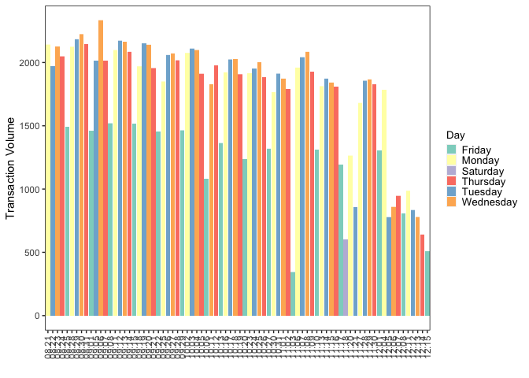

Planning Script
================
Last Update: July 17, 2024

# Package Loading

``` r
library(tidyverse)
```

    ## ── Attaching packages ─────────────────────────────────────── tidyverse 1.3.2 ──
    ## ✔ ggplot2 3.4.1      ✔ purrr   0.3.4 
    ## ✔ tibble  3.1.8      ✔ dplyr   1.0.10
    ## ✔ tidyr   1.2.1      ✔ stringr 1.4.1 
    ## ✔ readr   2.1.2      ✔ forcats 0.5.2 
    ## ── Conflicts ────────────────────────────────────────── tidyverse_conflicts() ──
    ## ✖ dplyr::filter() masks stats::filter()
    ## ✖ dplyr::lag()    masks stats::lag()

``` r
library(forcats)
library(lazyeval)
```

    ## 
    ## Attaching package: 'lazyeval'
    ## 
    ## The following objects are masked from 'package:purrr':
    ## 
    ##     is_atomic, is_formula

``` r
library(ggpubr)
```

# Data Loading

``` r
transaction_volume <- read.csv("/Users/kenjinchang/github/multimodal-dining-study/data/parent-data/transaction-volume-082023121623.csv")
```

# Data Cleaning

``` r
transaction_volume <- transaction_volume %>%
  select(Hour,X15.Minutes,Business.Date,Transactions) %>%
  rename(hour=Hour,interval=X15.Minutes,date=Business.Date,count=Transactions) %>%
  unite(minute_hour,c(hour,interval),sep=":",remove=FALSE) %>%
  unite(date_time,c(date,minute_hour),sep=", ", remove=FALSE)
```

adding day

``` r
transaction_volume <- transaction_volume %>%
  mutate(day=case_when(date=="08/21/2023"~"Monday",date=="08/22/2023"~"Tuesday",date=="08/23/2023"~"Wednesday",date=="08/24/2023"~"Thursday",date=="08/25/2023"~"Friday",date=="08/28/2023"~"Monday",date=="08/29/2023"~"Tuesday",date=="08/30/2023"~"Wednesday",date=="08/31/2023"~"Thursday",date=="09/01/2023"~"Friday",date=="09/05/2023"~"Tuesday",date=="09/06/2023"~"Wednesday",date=="09/07/2023"~"Thursday",date=="09/08/2023"~"Friday",date=="09/11/2023"~"Monday",date=="09/12/2023"~"Tuesday",date=="09/13/2023"~"Wednesday",date=="09/14/2023"~"Thursday",date=="09/15/2023"~"Friday",date=="09/18/2023"~"Monday",date=="09/19/2023"~"Tuesday",date=="09/20/2023"~"Wednesday",date=="09/21/2023"~"Thursday",date=="09/22/2023"~"Friday",date=="09/25/2023"~"Monday",date=="09/26/2023"~"Tuesday",date=="09/27/2023"~"Wednesday",date=="09/28/2023"~"Thursday",date=="09/29/2023"~"Friday",date=="10/02/2023"~"Monday",date=="10/03/2023"~"Tuesday",date=="10/04/2023"~"Wednesday",date=="10/05/2023"~"Thursday",date=="10/06/2023"~"Friday",date=="10/11/2023"~"Wednesday",date=="10/12/2023"~"Thursday",date=="10/13/2023"~"Friday",date=="10/16/2023"~"Monday",date=="10/17/2023"~"Tuesday",date=="10/18/2023"~"Wednesday",date=="10/19/2023"~"Thursday",date=="10/20/2023"~"Friday",date=="10/23/2023"~"Monday",date=="10/24/2023"~"Tuesday",date=="10/25/2023"~"Wednesday",date=="10/26/2023"~"Thursday",date=="10/27/2023"~"Friday",date=="10/30/2023"~"Monday",date=="10/31/2023"~"Tuesday",date=="11/01/2023"~"Wednesday",date=="11/02/2023"~"Thursday",date=="11/03/2023"~"Friday",date=="11/06/2023"~"Monday",date=="11/07/2023"~"Tuesday",date=="11/08/2023"~"Wednesday",date=="11/09/2023"~"Thursday",date=="11/10/2023"~"Friday",date=="11/13/2023"~"Monday",date=="11/14/2023"~"Tuesday",date=="11/15/2023"~"Wednesday",date=="11/16/2023"~"Thursday",date=="11/17/2023"~"Friday",date=="11/18/2023"~"Saturday",date=="11/20/2023"~"Monday",date=="11/21/2023"~"Tuesday",date=="11/27/2023"~"Monday",date=="11/28/2023"~"Tuesday",date=="11/29/2023"~"Wednesday",date=="11/30/2023"~"Thursday",date=="12/01/2023"~"Friday",date=="12/04/2023"~"Monday",date=="12/05/2023"~"Tuesday",date=="12/06/2023"~"Wednesday",date=="12/07/2023"~"Thursday",date=="12/08/2023"~"Friday",date=="12/11/2023"~"Monday",date=="12/12/2023"~"Tuesday",date=="12/13/2023"~"Wednesday",date=="12/14/2023"~"Thursday",date=="12/15/2023"~"Friday"))
```

``` r
transaction_volume <- transaction_volume %>%
  mutate(date_abbrev=case_when(date=="08/21/2023"~"08.21",date=="08/22/2023"~"08.22",date=="08/23/2023"~"08.23",date=="08/24/2023"~"08.24",date=="08/25/2023"~"08.25",date=="08/28/2023"~"08.28",date=="08/29/2023"~"08.29",date=="08/30/2023"~"08.30",date=="08/31/2023"~"08.31",date=="09/01/2023"~"09.01",date=="09/05/2023"~"09.05",date=="09/06/2023"~"09.06",date=="09/07/2023"~"09.07",date=="09/08/2023"~"09.08",date=="09/11/2023"~"09.11",date=="09/12/2023"~"09.12",date=="09/13/2023"~"09.13",date=="09/14/2023"~"09.14",date=="09/15/2023"~"09.15",date=="09/18/2023"~"09.18",date=="09/19/2023"~"09.19",date=="09/20/2023"~"09.20",date=="09/21/2023"~"09.21",date=="09/22/2023"~"09.22",date=="09/25/2023"~"09.25",date=="09/26/2023"~"09.26",date=="09/27/2023"~"09.27",date=="09/28/2023"~"09.28",date=="09/29/2023"~"09.29",date=="10/02/2023"~"10.02",date=="10/03/2023"~"10.03",date=="10/04/2023"~"10.04",date=="10/05/2023"~"10.05",date=="10/06/2023"~"10.06",date=="10/11/2023"~"10.11",date=="10/12/2023"~"10.12",date=="10/13/2023"~"10.13",date=="10/16/2023"~"10.16",date=="10/17/2023"~"10.17",date=="10/18/2023"~"10.18",date=="10/19/2023"~"10.19",date=="10/20/2023"~"10.20",date=="10/23/2023"~"10.23",date=="10/24/2023"~"10.24",date=="10/25/2023"~"10.25",date=="10/26/2023"~"10.26",date=="10/27/2023"~"10.27",date=="10/30/2023"~"10.30",date=="10/31/2023"~"10.31",date=="11/01/2023"~"11.01",date=="11/02/2023"~"11.02",date=="11/03/2023"~"11.03",date=="11/06/2023"~"11.06",date=="11/07/2023"~"11.07",date=="11/08/2023"~"11.08",date=="11/09/2023"~"11.09",date=="11/10/2023"~"11.10",date=="11/13/2023"~"11.13",date=="11/14/2023"~"11.14",date=="11/15/2023"~"11.15",date=="11/16/2023"~"11.16",date=="11/17/2023"~"11.17",date=="11/18/2023"~"11.18",date=="11/20/2023"~"11.20",date=="11/21/2023"~"11.21",date=="11/27/2023"~"11.27",date=="11/28/2023"~"11.28",date=="11/29/2023"~"11.29",date=="11/30/2023"~"11.30",date=="12/01/2023"~"12.01",date=="12/04/2023"~"12.04",date=="12/05/2023"~"12.05",date=="12/06/2023"~"12.06",date=="12/07/2023"~"12.07",date=="12/08/2023"~"12.08",date=="12/11/2023"~"12.11",date=="12/12/2023"~"12.12",date=="12/13/2023"~"12.13",date=="12/14/2023"~"12.14",date=="12/15/2023"~"12.15"))
```

remove Saturday

# Data Analysis

``` r
transaction_volume %>%
  group_by(date) %>%
  summarise(sum(count))
```

    ## # A tibble: 80 × 2
    ##    date       `sum(count)`
    ##    <chr>             <int>
    ##  1 08/21/2023         2141
    ##  2 08/22/2023         1971
    ##  3 08/23/2023         2129
    ##  4 08/24/2023         2048
    ##  5 08/25/2023         1494
    ##  6 08/28/2023         2123
    ##  7 08/29/2023         2184
    ##  8 08/30/2023         2222
    ##  9 08/31/2023         2147
    ## 10 09/01/2023         1461
    ## # … with 70 more rows

``` r
transaction_volume %>%
  ggplot(aes(x=date_abbrev,y=count,fill=day)) + 
  geom_col() +
  xlab("Date") + 
  ylab("Transaction Volume") + 
  scale_fill_brewer(palette="Set3",name="Day") +
  theme(axis.text.x=element_text(angle=90,vjust=0.5,hjust=1),legend.position="bottom",legend.justification="center",legend.box.spacing=unit(0,"pt"),legend.key.size=unit(10,"pt"),panel.grid=element_blank(),panel.background=element_rect(fill="white"),panel.border=element_rect(fill=NA),legend.title=element_text(size=10),legend.text=element_text(size=10),plot.title=element_text(size=10))
```

<!-- -->

``` r
transaction_volume %>%
  group_by(day) %>%
  summarise(sum(count))
```

    ## # A tibble: 6 × 2
    ##   day       `sum(count)`
    ##   <chr>            <int>
    ## 1 Friday           19363
    ## 2 Monday           27327
    ## 3 Saturday           605
    ## 4 Thursday         28871
    ## 5 Tuesday          28782
    ## 6 Wednesday        30312

``` r
transaction_volume %>%
  group_by(day) %>%
  summarise(mean(count),sd(count))
```

    ## # A tibble: 6 × 3
    ##   day       `mean(count)` `sd(count)`
    ##   <chr>             <dbl>       <dbl>
    ## 1 Friday            15.1        19.7 
    ## 2 Monday            19.2        24.4 
    ## 3 Saturday           7.76        9.89
    ## 4 Thursday          19.0        25.4 
    ## 5 Tuesday           18.8        25.3 
    ## 6 Wednesday         20.3        25.5

``` r
transaction_volume %>%
  group_by(date) %>%
  summarise(mean(count))
```

    ## # A tibble: 80 × 2
    ##    date       `mean(count)`
    ##    <chr>              <dbl>
    ##  1 08/21/2023          23.0
    ##  2 08/22/2023          20.1
    ##  3 08/23/2023          23.7
    ##  4 08/24/2023          20.9
    ##  5 08/25/2023          18.9
    ##  6 08/28/2023          22.6
    ##  7 08/29/2023          22.3
    ##  8 08/30/2023          22.7
    ##  9 08/31/2023          22.8
    ## 10 09/01/2023          18.0
    ## # … with 70 more rows

``` r
transaction_volume %>%
  ggplot(aes(x=count,y=fct_reorder(day,count,.fun="mean"),fill=day,color=day)) + 
  geom_violin(draw_quantiles=0.5,adjust=2.5,alpha=0.5) + 
  scale_fill_brewer(palette="Set3") + 
  scale_color_brewer(palette="Set3") + 
  geom_vline(xintercept=0,linetype="dashed",size=0.3) +
  xlab("Transaction Volume") + 
  ylab("") + 
  stat_summary(fun.y=mean,geom="point",shape=20,size=3,color="black",fill="white") +
  theme(legend.position="none",legend.justification="right",legend.box.spacing=unit(0,"pt"),legend.key.size=unit(10,"pt"),panel.grid=element_blank(),panel.background=element_rect(fill="white"),panel.border=element_rect(fill=NA),legend.title=element_text(size=10),legend.text=element_text(size=10),plot.title=element_text(size=10))
```

    ## Warning: Using `size` aesthetic for lines was deprecated in ggplot2 3.4.0.
    ## ℹ Please use `linewidth` instead.

    ## Warning: The `fun.y` argument of `stat_summary()` is deprecated as of ggplot2 3.3.0.
    ## ℹ Please use the `fun` argument instead.

<!-- -->

``` r
transaction_volume %>%
  ggplot(aes(x=count,y=fct_reorder(day,count,.fun="mean"),fill=day,color=day)) + 
  geom_boxplot(outlier.shape=NA,alpha=0.5) + 
  scale_fill_brewer(palette="Set3") + 
  scale_color_brewer(palette="Set3") + 
  geom_vline(xintercept=0,linetype="dashed",size=0.3) +
  stat_summary(fun.y=mean,geom="point",shape=20,size=3,color="black",fill="white") +
  coord_cartesian(xlim=c(0,75)) +
  xlab("Transaction Volume") + 
  ylab("") + 
  theme(legend.position="none",legend.justification="right",legend.box.spacing=unit(0,"pt"),legend.key.size=unit(10,"pt"),panel.grid=element_blank(),panel.background=element_rect(fill="white"),panel.border=element_rect(fill=NA),legend.title=element_text(size=10),legend.text=element_text(size=10),plot.title=element_text(size=10))
```

<!-- -->

``` r
transaction_volume %>%
  group_by(day) %>%
  summarise(mean(count),sd(count))
```

    ## # A tibble: 6 × 3
    ##   day       `mean(count)` `sd(count)`
    ##   <chr>             <dbl>       <dbl>
    ## 1 Friday            15.1        19.7 
    ## 2 Monday            19.2        24.4 
    ## 3 Saturday           7.76        9.89
    ## 4 Thursday          19.0        25.4 
    ## 5 Tuesday           18.8        25.3 
    ## 6 Wednesday         20.3        25.5

``` r
transaction_volume %>%
  group_by(hour) %>%
  summarise(sum(count))
```

    ## # A tibble: 10 × 2
    ##     hour `sum(count)`
    ##    <int>        <int>
    ##  1     6            2
    ##  2     7           45
    ##  3     8         6823
    ##  4     9         9081
    ##  5    10         7225
    ##  6    11        33083
    ##  7    12        36560
    ##  8    13        29052
    ##  9    14        13092
    ## 10    15          297

``` r
transaction_volume %>%
  group_by(minute_hour) %>%
  summarise(sum(count))
```

    ## # A tibble: 35 × 2
    ##    minute_hour `sum(count)`
    ##    <chr>              <int>
    ##  1 10:00-14            3697
    ##  2 10:15-29            1908
    ##  3 10:30-44             583
    ##  4 10:45-59            1037
    ##  5 11:00-14            8063
    ##  6 11:15-29            7557
    ##  7 11:30-44            9820
    ##  8 11:45-59            7643
    ##  9 12:00-14            9450
    ## 10 12:15-29           11160
    ## # … with 25 more rows

``` r
transaction_volume %>%
  group_by(date_time) %>%
  summarise(sum(count))
```

    ## # A tibble: 2,291 × 2
    ##    date_time            `sum(count)`
    ##    <chr>                       <int>
    ##  1 08/21/2023, 10:00-14           47
    ##  2 08/21/2023, 10:15-29           35
    ##  3 08/21/2023, 10:30-44           18
    ##  4 08/21/2023, 10:45-59           22
    ##  5 08/21/2023, 11:00-14          132
    ##  6 08/21/2023, 11:15-29          126
    ##  7 08/21/2023, 11:30-44          129
    ##  8 08/21/2023, 11:45-59          126
    ##  9 08/21/2023, 12:00-14          171
    ## 10 08/21/2023, 12:15-29          182
    ## # … with 2,281 more rows

``` r
write.csv(transaction_volume,"~/github/multimodal-dining-study/data/output/historical-transaction-volume.csv")
```

write.csv(university_impact_model,“~/github/university-impact-model/data/model-output/university-impact-model.csv”)
